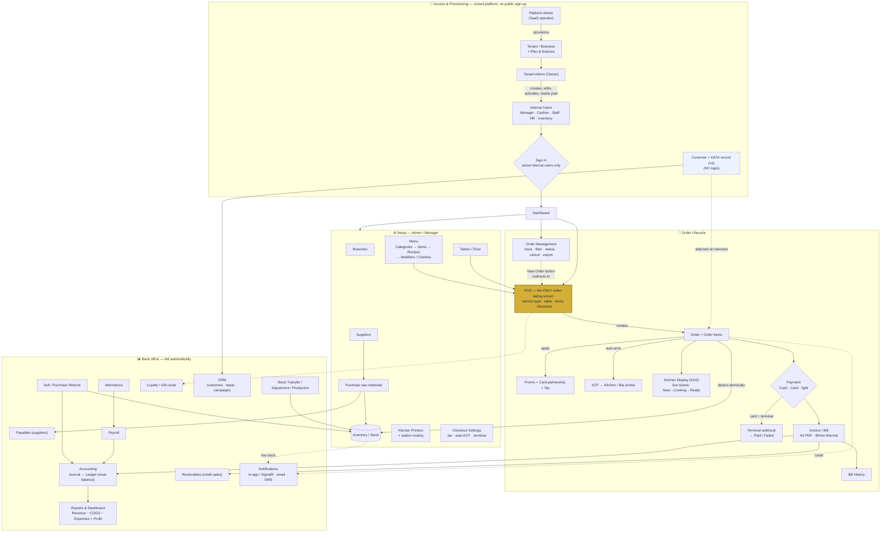

# System Flowchart — Restaurant Management SaaS

> Reflects the **closed-platform** design currently being applied: no public sign-up, the
> Administrator provisions all users, customers are data-only (no login), **POS is the single
> order-taking screen**, and **Order Management** only tracks/manages orders (its "New Order"
> button redirects to the POS).
>
> View this rendered: open in VS Code (Markdown Preview + Mermaid extension), on GitHub, or paste
> the block below into https://mermaid.live.

## How to read it
- **POS vs Order Management (your question):** they are **separate**. The **POS** is the one place an
  order is *created*. **Order Management** is a back-office list to *track/manage* existing orders;
  its "New Order" button just opens the POS — it is not a second creation path.
- **Closed platform:** the Platform Admin provisions tenants; each Owner provisions internal users.
  There is no public sign-up, and **customers never log in** — they are data records attached at
  checkout and used by CRM/loyalty/receivables.
- **Solid arrows** = a direct flow/creates; **dotted arrows** = a link/reference or async event.
- Everything downstream of an order (accounting, receivables, loyalty, notifications, reports) is
  fed automatically when the order/payment completes.
